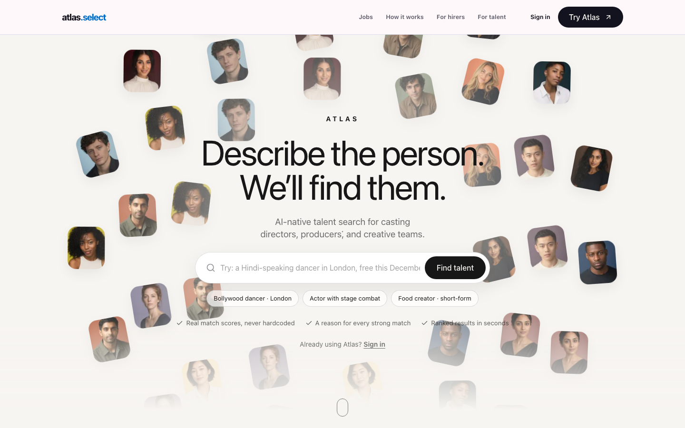
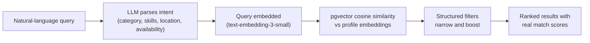

<div align="center">

# 🌐 Atlas

**AI-native talent discovery for the creative industry**

Find dancers, actors, and content creators with natural-language search - powered by real vector matching, not keyword filters.

[](https://github.com/selectatlas/atlas/actions/workflows/ci.yml)
[](https://nextjs.org)
[](https://react.dev)
[](https://supabase.com)
[](https://www.typescriptlang.org)

[**Live site**](https://www.atlas.select) · [Product spec](docs/prd.md) · [Design system](docs/design.md) · [Deployment guide](docs/supabase-deployment.md)



</div>

---

## What is Atlas?

Atlas is a two-sided marketplace connecting **hirers** (casting directors, brands, producers) with **creative talent**. Instead of rigid category filters, hirers describe who they need in plain English - *"street dancer in London available next month for a commercial"* - and Atlas returns ranked matches with real similarity scores in under two seconds.

### How the AI search works



Match scores are always computed - never hardcoded.

## ✨ Features

| | Feature | Description |
|---|---|---|
| 🔍 | **AI talent search** | Natural-language queries parsed by an LLM, matched via pgvector embeddings, refined by structured filters |
| 🃏 | **Discover** | Swipeable talent cards for fast browsing on mobile |
| 💼 | **Jobs board** | Hirers post roles; talent browse, apply, and track application status end to end |
| ✉️ | **AI outreach** | One-click personalised outreach messages drafted from the hirer's context and the talent's profile |
| 💬 | **Messaging** | Real-time 1:1 threads with read receipts, typing indicators, emoji reactions, reply-to quoting, and AI writing assistance |
| 📣 | **Shortlist broadcast** | Message every shortlisted talent at once - fanned out into individual conversations |
| 🔖 | **Shortlists and likes** | Save talent, compare them side by side, invite them to jobs |
| 🔔 | **Unified inbox** | Live badge counts across messages, applications, outreach replies, and saved-search alerts |
| ⭐ | **Reviews and verification** | Per-hire reviews and verified-talent trust signals |
| 🛡️ | **Platform admin** | Moderation, reports, user management, and suspension tooling |

## 🧱 Tech stack

| Layer | Technology |
|---|---|
| Framework | [Next.js 16](https://nextjs.org) (App Router) · [React 19](https://react.dev) · TypeScript (strict) |
| Styling | [Tailwind CSS v4](https://tailwindcss.com) · [shadcn/ui](https://ui.shadcn.com) (`base-nova`, Base UI primitives) |
| Data and auth | [Supabase](https://supabase.com) - Postgres, Auth, Storage, Realtime, row-level security |
| AI | [OpenAI](https://platform.openai.com) - `text-embedding-3-small` embeddings + GPT-4o-mini-class query parsing and drafting |
| Vector search | [pgvector](https://github.com/pgvector/pgvector) - embeddings live next to profile data |
| Hosting | [Vercel](https://vercel.com) |
| Analytics | [PostHog](https://posthog.com) (optional) |
| Testing | [Vitest](https://vitest.dev) · [Playwright](https://playwright.dev) · [pgTAP](https://pgtap.org) |

## 🚀 Getting started

**Prerequisites:** Node.js 20+, npm, and (for database-backed tests) Docker + the [Supabase CLI](https://supabase.com/docs/guides/cli).

```bash
git clone https://github.com/selectatlas/atlas.git
cd atlas
npm install
cp .env.example .env.local   # then fill in real values
npm run dev
```

Open [http://localhost:3000](http://localhost:3000). A demo login button is enabled automatically in dev.

### Environment variables

Every variable is documented in [`.env.example`](.env.example). The server validates them at startup ([`src/instrumentation.ts`](src/instrumentation.ts)) and fails **by name** when one is missing.

| Variable | Scope | Purpose |
|---|---|---|
| `NEXT_PUBLIC_SUPABASE_URL` | Browser-safe | Supabase project URL |
| `NEXT_PUBLIC_SUPABASE_PUBLISHABLE_KEY` | Browser-safe | Supabase publishable (anon) key |
| `SUPABASE_SERVICE_ROLE_KEY` | **Server-only** | Privileged Supabase access |
| `OPENAI_API_KEY` | **Server-only** | Embeddings, query parsing, outreach drafting |
| `NEXT_PUBLIC_SITE_URL` | Optional | Canonical origin for sitemap, robots, and Open Graph |
| `NEXT_PUBLIC_POSTHOG_*` | Optional | Analytics (app runs without them) |
| `ATLAS_ADMIN_EMAILS` | Optional | Emails bootstrapped as platform admins on sign-in |

> ⚠️ Server-only keys must **never** be prefixed with `NEXT_PUBLIC_` or imported into client components. CI greps the built client bundles for their values and fails if found.

### Seed data

```bash
npm run seed    # generate the demo world
npm run embed   # generate profile embeddings (requires OPENAI_API_KEY)
```

## 🛠️ Commands

| Command | What it does |
|---|---|
| `npm run dev` | Start the dev server (demo login enabled) |
| `npm run build` | Production build |
| `npm run lint` | ESLint - warnings fail (`--max-warnings 0`) |
| `npm run typecheck` | `tsc --noEmit` |
| `npm test` | Unit tests (mocked, fast) |
| `npm run test:integration` | Real-database RLS tests (needs local Supabase) |
| `npm run test:e2e` | Playwright end-to-end journeys |
| `npm run seed` / `npm run embed` | Demo data and embeddings |

**Validate any change with:** `npm run lint && npm run typecheck && npm test`

## 🧪 Testing

Unit tests are colocated with the modules they cover (`src/lib/*.test.ts`, `route.test.ts` next to `route.ts`). They are fast and fully mocked - which means they are **not** evidence that auth or tenant isolation works. That proof comes from the database-backed suites below, which run against a real local Supabase stack:

```bash
supabase start                      # local stack on the 553xx ports
supabase test db                    # pgTAP policy tests (supabase/tests/)
set -a; eval "$(supabase status -o env)"; set +a
npm run test:integration            # real-database RLS tests (vitest)

# End-to-end (production build against the local stack; NEXT_PUBLIC_* values
# are inlined at build time so the build must use the stack URL):
NEXT_PUBLIC_SUPABASE_URL=$API_URL \
NEXT_PUBLIC_SUPABASE_PUBLISHABLE_KEY=$PUBLISHABLE_KEY \
SUPABASE_SERVICE_ROLE_KEY=$SERVICE_ROLE_KEY \
OPENAI_API_KEY=sk-local-placeholder npm run build
npm run test:e2e                    # Playwright journeys
```

CI runs the full ladder on every push: lint → typecheck → unit tests → build → `npm audit` (high severity blocks) → client-bundle secret check → pgTAP → RLS integration → Playwright.

## 📁 Project structure

```
atlas/
├── src/
│   ├── app/
│   │   ├── (auth)/          # Login, signup
│   │   ├── (app)/           # Authenticated app
│   │   │   ├── (hirer)/     #   Search, discover, shortlists, my-jobs, outreach
│   │   │   └── (talent)/    #   Profile, jobs, applications
│   │   ├── (admin)/         # Platform admin
│   │   ├── (legal)/         # Terms, privacy
│   │   ├── api/             # Route handlers (search, jobs, messages, ...)
│   │   └── actions/         # Server actions
│   ├── components/          # Feature folders over shadcn/ui primitives
│   ├── lib/                 # Domain logic - one file per concern, colocated tests
│   │   └── seed/            # Demo world generation
│   ├── proxy.ts             # Next.js 16 proxy: session refresh + route protection
│   └── instrumentation.ts   # Startup env validation
├── supabase/
│   ├── migrations/          # Canonical schema (append-only, RLS lives here)
│   └── tests/               # pgTAP policy tests
├── e2e/                     # Playwright specs
├── tests/integration/       # Real-database RLS tests
└── docs/                    # PRD, design system, deployment, checklists
```

## 🗄️ Database

Supabase migrations in [`supabase/migrations/`](supabase/migrations/) are the **canonical schema** - never edit an existing migration; append a new numbered one. Row-level security policies live in the migrations and are proven by pgTAP and the integration suite.

See [docs/supabase-deployment.md](docs/supabase-deployment.md) for clean-database verification, deployment, and recovery steps.

## 🔒 Security

- **RLS everywhere** - every user-data table is policy-protected, with tests to prove it
- **Server-only AI keys** - all OpenAI calls run in route handlers or server actions; CI verifies no secret reaches a client bundle
- **Ownership checks** - resource endpoints validate the caller owns the resource, not just that they are signed in
- **Rate limiting** - on messaging, reactions, outreach, uploads, and auth-adjacent endpoints
- **Suspension enforcement** - held at the API layer, not just page redirects

Deliberately accepted dependency advisories are recorded in [docs/security-advisories.md](docs/security-advisories.md); CI fails on any undocumented high-severity production advisory.

## ☁️ Deployment

Atlas deploys to **Vercel** with a hosted Supabase project:

1. Apply migrations to the hosted database (see [docs/supabase-deployment.md](docs/supabase-deployment.md))
2. Set all required environment variables in the Vercel project (not just locally)
3. Confirm `NEXT_PUBLIC_SITE_URL` points at the production domain
4. Deploy - `src/instrumentation.ts` will fail the boot loudly if anything is missing

## 📚 Documentation

| Document | Contents |
|---|---|
| [docs/prd.md](docs/prd.md) | Full product spec |
| [docs/design.md](docs/design.md) | Design tokens and system (with [live style guide](docs/design.html)) |
| [docs/supabase-deployment.md](docs/supabase-deployment.md) | Database deployment and recovery |
| [docs/launch-checklist.md](docs/launch-checklist.md) | Pre-launch checklist |
| [AGENTS.md](AGENTS.md) | Project conventions for AI coding agents |

## 📄 License

Copyright © 2026 Atlas. All rights reserved. This is proprietary software - not licensed for redistribution.
