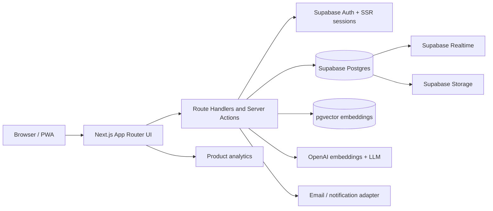

# PRD — Atlas

**Version:** 2.0  
**Status:** Product blueprint for the full experience, implemented in prioritised releases  
**Updated:** 2026-07-10  
**Source references:** `atlas-prd.md`, `docs/design.md`, and `dots-ui-design/*`

## 1. Overview

### Product Summary

Atlas is an AI-native creative talent network for discovering, evaluating, connecting with, and hiring creative people. Hirers describe the person they need in natural language and receive ranked, evidence-rich matches; talent build profiles that make their work discoverable and receive relevant opportunities. The broader experience adds the retention loops visible in the reference set—profiles, jobs, community, companies, follows, connections, events, notifications, and messaging—without allowing those surfaces to dilute the core matching promise.

### Objective

This PRD replaces the investor-demo-only scope with a complete product direction and an implementation-ready release plan. The target experience is a role-aware creative network with three connected loops:

1. **Discover:** search, browse, match, follow, save, and receive recommendations.
2. **Prove:** present work, skills, credits, availability, and context in a trustworthy profile.
3. **Connect:** shortlist, message, apply, collaborate, follow companies, participate in community, and move toward a hiring outcome.

P0 makes the discovery-to-conversation loop dependable. P1 adds community, people, companies, follows, saved searches, alerts, events, and richer retention. P2 adds team workflows, verification, monetisation, moderation operations, and recommendation learning.

### Market Differentiation

Atlas is not a generic professional network with a creative category added. Its differentiator is intent-aware matching over evidence of creative ability. The implementation must make a match understandable: a result is ranked because of specific skills, work, location, availability, language, credits, or job requirements—not because of an opaque popularity score. The interface should feel calm and editorial like the reference set, while the product logic is more focused, faster, more transparent, and more useful for real casting and hiring decisions.

### Magic Moment

A hirer types a request such as “a Hindi-speaking Bollywood dancer in London, available for a December campaign.” Within 2 seconds, Atlas returns a concise ranked set of talent with visible match reasons, portfolio evidence, availability, and a clear next action. The hirer opens one profile, understands the fit in under 20 seconds, asks Atlas to draft a contextual message, edits it if needed, and sends it without losing the original search or job context.

The talent magic moment is the reciprocal experience: after a short onboarding flow and profile import or completion, the person sees why a job matches them, can apply or express interest in one step, and can continue the conversation in a contextual thread.

### Success Criteria

- 80% of test hirers reach a relevant shortlist from a natural-language query in under 60 seconds.
- P0 search response is under 2 seconds at p95 for seeded/demo data and under 3 seconds at p95 for the first production cohort.
- At least 8 relevant results are returned for each rehearsed demo query; weak matches are labelled rather than presented as false certainty.
- A hirer can go from search to edited outreach message in three primary actions or fewer.
- A talent can complete the minimum discoverable profile in under 5 minutes and see an actionable matched opportunity.
- All P0 journeys have empty, loading, error, permission, and mobile states.
- At least 90% of interactive controls are keyboard reachable and all critical actions have accessible names and focus states.
- No AI action sends, applies, rejects, or changes a relationship state without explicit user confirmation.

### Current Baseline and Gap

The repository already contains a useful P0 foundation: Next.js App Router, Supabase auth/database/storage/pgvector, OpenAI search and outreach helpers, hirer and talent layouts, talent search, swipe/list modes, profiles, jobs, applications, outreach, direct messages, shortlists, activity, PWA assets, and a Atlas token system in `docs/design.md`.

The main gaps are not a lack of isolated screens. They are experience-level gaps: onboarding and role context, a coherent home workspace, visible match explanations, richer evidence and profile structure, persistent relationship state, saved searches and alerts, community/people/company discovery, notification orchestration, and consistent states across the product. Existing routes and database tables should be extended through additive migrations rather than discarded.

## 2. Technical Architecture

### Architecture Overview



The current app is server-rendered where possible and uses client components for interactive search, swipe, messaging, uploads, and forms. Preserve this split. AI keys and service-role credentials remain server-only. Realtime is used for message and notification freshness, not as a substitute for durable database state.

### Chosen Stack

| Layer | Choice | Implementation guidance |
|---|---|---|
| Framework | Next.js App Router | Use route groups for auth, hirer, talent, and shared product surfaces; use server components for initial data and client components for interaction |
| Language | TypeScript | Share domain types and validation schemas between routes and UI where practical |
| Styling | Tailwind CSS v4 | Use the semantic tokens and primitives described in `docs/design.md`; do not create one-off visual systems per feature |
| UI primitives | Base UI/shadcn-compatible components, Lucide | Extend existing primitives in `src/components/ui` before creating feature-local controls |
| Backend | Next.js route handlers and server actions | Keep mutations server-side and validate every request with a schema |
| Database | Supabase Postgres | Add additive migrations for social, company, notification, saved-search, and evidence entities |
| Search | pgvector plus structured filters | Keep semantic ranking and explicit filter constraints separate, then combine them into an explainable result |
| Auth | Supabase Auth with SSR cookies | Preserve the current server client and proxy/session pattern |
| Storage | Supabase Storage | Store avatars, cover images, portfolio media, and attachments in private or public buckets according to visibility rules |
| AI | OpenAI embeddings and LLM | Use server-side query parsing, structured output, embeddings, drafting, summarisation, and profile improvement suggestions |
| Hosting | Vercel | Deploy the Next.js app with preview environments and production environment variables |
| PWA | Web manifest and service worker | Keep installability and offline shell support; do not promise offline search or messaging |

### Stack Integration Guide

1. Keep `src/lib/supabase/server.ts` as the only server-side session entry point and `src/lib/supabase/client.ts` for browser usage.
2. Add request schemas in a shared `src/lib/validation/` directory using `zod`; parse body, query, and route parameters before database calls.
3. Keep OpenAI calls in `src/lib/openai.ts` or feature-specific server helpers. Use structured JSON output for search intent and never trust model-generated IDs or permissions.
4. Use the user-scoped Supabase client for user-visible reads and writes. Use the service client only for embedding generation, indexing jobs, and controlled server-side operations.
5. Add migrations in `supabase/migrations/` in dependency order. Update `src/types/index.ts` after each migration and keep generated database types if the project adopts them.
6. Use database constraints for uniqueness and ownership. Route handlers should translate constraint violations into stable error codes rather than exposing raw database messages.
7. Use Supabase Realtime for message threads and notifications only after row-level security policies are in place.
8. Make AI and external-service failures non-blocking wherever possible. A search can fall back to structured browse; an outreach draft can fall back to a blank editable message.

Required environment variables:

```text
NEXT_PUBLIC_SUPABASE_URL
NEXT_PUBLIC_SUPABASE_ANON_KEY
SUPABASE_SERVICE_ROLE_KEY
OPENAI_API_KEY
NEXT_PUBLIC_APP_URL
NEXT_PUBLIC_POSTHOG_KEY          # when analytics is enabled
NEXT_PUBLIC_POSTHOG_HOST         # when analytics is enabled
RESEND_API_KEY                   # when transactional email is enabled
SENTRY_DSN                       # when error tracking is enabled
```

### Repository Structure

```text
atlas/
├── src/
│   ├── app/
│   │   ├── (auth)/               # Login, signup, password recovery
│   │   ├── (hirer)/              # Search, jobs, outreach, hirer workspace
│   │   ├── (talent)/             # Discover, profile, talent workspace
│   │   ├── community/            # Feed, post detail, composer
│   │   ├── people/               # People search and discovery
│   │   ├── companies/            # Company directory and pages
│   │   ├── events/               # Event directory and RSVP
│   │   ├── messages/             # Inbox and contextual threads
│   │   ├── notifications/        # Notification centre
│   │   ├── settings/             # Account, privacy, notification settings
│   │   └── api/                  # Validated route handlers
│   ├── components/
│   │   ├── ui/                   # Shared accessible primitives
│   │   ├── layout/               # Shell, navigation, command menu
│   │   ├── search/               # Query input, filters, results, explanations
│   │   ├── talent/               # Cards, profile, portfolio, credits
│   │   ├── jobs/                 # Job cards, detail, application controls
│   │   ├── community/            # Feed cards, composer, comments
│   │   ├── companies/            # Company cards and page sections
│   │   └── messaging/            # Thread list, messages, context panel
│   ├── lib/
│   │   ├── supabase/             # Server and browser clients
│   │   ├── validation/           # Shared zod schemas
│   │   ├── search/               # Query parsing, ranking, explanations
│   │   ├── notifications/        # Event-to-notification rules
│   │   └── analytics/            # Event names and tracking helpers
│   └── types/                    # Shared domain and API types
├── supabase/
│   ├── migrations/               # Ordered additive schema changes
│   ├── schema.sql                # Reference schema for new environments
│   └── functions.sql             # Search/ranking database functions
├── public/                       # PWA assets and static media
├── docs/
│   ├── design.md                 # Visual source of truth
│   ├── dots-ui-reference-analysis.md
│   └── prd.md
└── tests/                        # Unit, route, and journey tests as added
```

### Infrastructure & Deployment

- Deploy the Next.js application to Vercel.
- Run Supabase migrations in staging before production; never apply schema changes manually in production without recording a migration.
- Seed a deterministic demo dataset in a separate development/demo project or clearly namespaced records. Never mix placeholder people with real users.
- Configure preview and production environment variables separately.
- Add CI checks for `npm run lint`, `npm test`, and `npm run build`.
- Add a smoke test against a seeded preview environment for login, search, profile, message, job, and application journeys.

### Security Considerations

- Use `supabase.auth.getUser()` on the server for protected routes; do not authorise from client metadata alone.
- Enforce ownership and role checks in both route handlers and database policies.
- Keep `SUPABASE_SERVICE_ROLE_KEY` and `OPENAI_API_KEY` out of client bundles and logs.
- Validate and length-limit all user text, URLs, media types, and uploaded files. Sanitize rich text if rich text is introduced.
- Apply rate limits to login-related actions, AI generation, search, messaging, connection requests, and post creation.
- Make public profile visibility explicit. Do not expose private email, unpublished portfolio items, or private messages through broad profile queries.
- Scrub names, message content, tokens, and media URLs from Sentry payloads unless a user has explicitly opted into diagnostic sharing.
- Add block, report, and mute primitives before community launch; moderation can be operationally manual at first.

### Cost Estimate

At fewer than 1,000 users, the existing stack should remain within free or low-cost tiers for development. Actual cost depends on media storage, OpenAI volume, and email volume. Budget for Vercel hosting, Supabase database/storage/auth/realtime, usage-based OpenAI calls, Resend transactional email when enabled, PostHog analytics when enabled, and Sentry error tracking when enabled. Cache embeddings, debounce search, and cap draft generations per user.

## 3. Data Model

### Entity Definitions

The current schema already has `profiles`, `talent_skills`, `profile_embeddings`, `jobs`, `job_embeddings`, `applications`, `outreach`, `shortlists`, `message_threads`, `thread_participants`, and `messages`. Keep these names where possible and add the following fields/tables through migrations.

#### `profiles`

```sql
id uuid primary key references auth.users(id) on delete cascade
account_type text not null check (account_type in ('hirer', 'talent'))
full_name text not null
email text not null
avatar_url text
cover_url text
headline text
city text
country text
bio text
rates text
availability text
availability_status text not null default 'unknown'
showreel_url text
profile_visibility text not null default 'public'
onboarding_completed boolean not null default false
created_at timestamptz not null default now()
updated_at timestamptz not null default now()
```

`availability_status` is one of `available`, `limited`, `unavailable`, or `unknown`. `profile_visibility` is one of `public`, `members`, or `private`; private profiles are not eligible for discovery.

#### `talent_skills`

Keep the existing fields and add `display_name`, `years_experience`, and `is_featured`. A skill must be normalised to a known taxonomy value where possible, while allowing a pending custom skill for moderation.

#### `credits`

```sql
id uuid primary key default gen_random_uuid()
profile_id uuid not null references profiles(id) on delete cascade
title text not null
production text not null
company text
start_date date
end_date date
description text
media_url text
category text
sort_order integer not null default 0
created_at timestamptz not null default now()
```

#### `portfolio_items`

```sql
id uuid primary key default gen_random_uuid()
profile_id uuid not null references profiles(id) on delete cascade
type text not null check (type in ('video', 'image', 'link'))
url text not null
title text
description text
thumbnail_url text
is_featured boolean not null default false
sort_order integer not null default 0
created_at timestamptz not null default now()
```

#### `saved_searches`

```sql
id uuid primary key default gen_random_uuid()
owner_id uuid not null references profiles(id) on delete cascade
name text not null
audience text not null check (audience in ('talent', 'jobs', 'people', 'companies'))
query_text text
filters jsonb not null default '{}'
alert_frequency text not null default 'off' check (alert_frequency in ('off', 'instant', 'daily', 'weekly'))
last_run_at timestamptz
created_at timestamptz not null default now()
updated_at timestamptz not null default now()
```

#### `connections`

```sql
id uuid primary key default gen_random_uuid()
requester_id uuid not null references profiles(id) on delete cascade
addressee_id uuid not null references profiles(id) on delete cascade
status text not null default 'pending' check (status in ('pending', 'accepted', 'declined', 'blocked'))
message text
created_at timestamptz not null default now()
responded_at timestamptz
unique(requester_id, addressee_id)
check(requester_id <> addressee_id)
```

#### `companies` and `company_members`

`companies` contains `id`, `name`, `slug`, `logo_url`, `cover_url`, `description`, `website_url`, `industry`, `location`, `visibility`, `created_at`, and `updated_at`. `company_members` contains `company_id`, `profile_id`, `role`, `status`, and timestamps. A lightweight company page can be created by an approved hirer; company verification is a P2 workflow.

#### `company_follows`

Contains `company_id`, `profile_id`, `created_at`, and a unique pair constraint. Following is separate from a connection and drives job/event alerts.

#### `community_posts`, `post_comments`, and `post_reactions`

`community_posts` contains `id`, `author_id`, `post_type` (`question`, `collaboration`, `availability`, `project`, `opportunity`), `title`, `body`, `media_url`, `linked_job_id`, `linked_company_id`, `status`, `created_at`, and `updated_at`. Comments contain `post_id`, `author_id`, `body`, `created_at`, and `updated_at`. Reactions contain `post_id`, `profile_id`, `type`, and a unique pair constraint. Posts are paginated and reportable.

#### `events` and `event_rsvps`

`events` contains `id`, `host_id`, `company_id`, `title`, `description`, `event_type`, `starts_at`, `ends_at`, `location`, `url`, `image_url`, `status`, and timestamps. RSVPs contain `event_id`, `profile_id`, `status` (`interested`, `going`, `cancelled`), and timestamps.

#### `notifications`

Contains `id`, `recipient_id`, `type`, `actor_id`, `entity_type`, `entity_id`, `title`, `body`, `read_at`, `created_at`, and `delivery_status`. Notification creation is idempotent by event/entity/recipient. Store enough entity context to render a useful notification if the source item changes.

#### `search_sessions` and `search_results`

`search_sessions` records `owner_id`, `query_text`, `parsed_intent`, `filters`, `created_at`, and latency. `search_results` records `session_id`, `profile_id` or `job_id`, `rank`, `similarity`, `match_score`, and `match_reasons`. These records make ranking explainable and allow future recommendation learning without relying on client state.

#### `shortlist_lists` and `shortlist_items`

Keep the current one-click `shortlists` table compatible, then migrate to named lists: `shortlist_lists` contains `id`, `owner_id`, `name`, `job_id`, `created_at`; `shortlist_items` contains `list_id`, `talent_id`, `notes`, `status`, `created_at`, `updated_at`. A default list preserves the current behaviour.

#### Existing entities requiring extension

- `jobs`: add `company_id`, `employment_type`, `remote_status`, `deadline`, `published_at`, and `updated_at`.
- `applications`: add `cover_note`, `last_actor_id`, `updated_at`, and a status history table for auditability.
- `outreach`: add `job_id`, `thread_id`, `draft_source`, and `updated_at`.
- `messages`: add optional `metadata jsonb` for job/profile context and `read_at` on the participant or message receipt model.

### Relationships

- A profile has many skills, credits, portfolio items, authored posts, notifications, messages, applications, and saved searches.
- A hirer owns many jobs, shortlist lists, outreach records, and company memberships.
- A talent can apply to many jobs; a job has many applications; one talent can apply once per job.
- A message thread has two or more participants and many messages; every thread must have an owner-visible context when created from a job, profile, shortlist, or post.
- Profiles can have many connections, but a pair has one relationship state regardless of request direction.
- A profile can follow many companies; a company can have many followers, jobs, events, and members.
- A community post can link to one job or company and has many comments/reactions.
- A saved search belongs to one profile and can create many notification events.

### Indexes

- `profiles(account_type, profile_visibility, city)` for discoverable people filters.
- `talent_skills(profile_id, category, skill)` for skill filtering.
- `profile_embeddings using ivfflat (embedding vector_cosine_ops)` for semantic search; tune lists as the dataset grows.
- `jobs(status, category, location, published_at desc)` for job browse.
- `applications(job_id, status, created_at desc)` and `applications(talent_id, status, created_at desc)` for both dashboards.
- `messages(thread_id, created_at desc)` for thread loading.
- `notifications(recipient_id, read_at, created_at desc)` for the inbox badge and centre.
- `community_posts(post_type, status, created_at desc)` for filtered feed browsing.
- `saved_searches(owner_id, alert_frequency)` for alert processing.
- Unique indexes for follows, connections, reactions, RSVPs, applications, and shortlist items.

## 4. API Specification

### API Design Philosophy

Use REST-style route handlers under `/api` with JSON responses. Supabase session cookies provide authentication; the server derives the current profile and account type. All errors use a stable shape:

```json
{
  "error": {
    "code": "VALIDATION_ERROR",
    "message": "A readable explanation",
    "fields": { "title": "Title is required" }
  }
}
```

List endpoints return `{ data, nextCursor, total }` where practical. Use cursor pagination for feed, jobs, people, messages, notifications, and profile results; use page numbers only where a stable page count is meaningful. Never return private fields through a public list endpoint.

### Existing endpoints to preserve and harden

```text
POST /api/search
Auth: Required hirer
Body: { query: string, filters?: SearchFilters, mode?: "list" | "grid" | "swipe" }
Response 200: { sessionId, parsedIntent, results: TalentSearchResult[], latencyMs }

POST /api/outreach
Auth: Required hirer
Body: { talentId: string, jobId?: string, action: "generate" | "send", message?: string, context?: string }
Response 200: { draft?: string, outreach?: Outreach }

GET /api/shortlist
POST /api/shortlist
Auth: Required hirer
Body: { talentId: string, listId?: string }
Response 200: { shortlisted: boolean, listId?: string }

GET /api/jobs
POST /api/jobs
GET /api/jobs/[id]
PATCH /api/jobs/[id]
Auth: Read is public/member according to visibility; write is the owning hirer

POST /api/applications
PATCH /api/applications/[id]
Auth: Talent creates; owning hirer updates status

GET /api/messages/threads
POST /api/messages/threads
GET /api/messages/threads/[id]
POST /api/messages/threads/[id]
Auth: Thread participants only
```

### New endpoints

```text
GET /api/me
PATCH /api/me/profile
POST /api/me/onboarding/complete
GET /api/me/activity
GET /api/me/notifications
PATCH /api/me/notifications/[id]
PATCH /api/me/notification-preferences

GET /api/talent
  Query: q, category, skill, location, availability, cursor, limit, sort
GET /api/talent/[id]
POST /api/talent/[id]/view
POST /api/talent/[id]/connect
POST /api/talent/[id]/follow

GET /api/saved-searches
POST /api/saved-searches
PATCH /api/saved-searches/[id]
DELETE /api/saved-searches/[id]
POST /api/saved-searches/[id]/run

GET /api/connections
POST /api/connections/[id]/accept
POST /api/connections/[id]/decline
DELETE /api/connections/[id]

GET /api/community/posts
POST /api/community/posts
GET /api/community/posts/[id]
PATCH /api/community/posts/[id]
DELETE /api/community/posts/[id]
POST /api/community/posts/[id]/comments
POST /api/community/posts/[id]/reaction
POST /api/community/posts/[id]/report

GET /api/companies
POST /api/companies
GET /api/companies/[slug]
PATCH /api/companies/[id]
POST /api/companies/[id]/follow
GET /api/companies/[id]/jobs
GET /api/companies/[id]/events

GET /api/events
POST /api/events
GET /api/events/[id]
POST /api/events/[id]/rsvp
```

The search response must include explainable reasons in a deterministic shape:

```json
{
  "profileId": "uuid",
  "matchScore": 92,
  "matchReasons": [
    { "type": "skill", "label": "Bollywood dance" },
    { "type": "location", "label": "London" },
    { "type": "availability", "label": "Available in December" }
  ],
  "evidence": { "portfolioItemId": "uuid", "creditId": "uuid" }
}
```

## 5. User Stories

### Epic: Onboarding and role context

**US-001: Choose a useful starting role**  
As a new user, I want to choose whether I am hiring, offering my talent, or both in a guided flow so that the product shows me relevant actions immediately.

Acceptance Criteria:

- [ ] The account type is stored in the profile and can be changed only through an explicit settings action.
- [ ] The first session ends with one clear recommended next action.
- [ ] A user can skip optional profile fields and return to them later.

**US-002: Build a discoverable profile**  
As talent, I want to add work, skills, credits, availability, and links so that the right hirers can find and trust me.

Acceptance Criteria:

- [ ] Onboarding shows required, recommended, and optional fields.
- [ ] Completion suggestions explain why each missing field improves discovery.
- [ ] Saving profile evidence regenerates the searchable representation without blocking the user.

### Epic: AI discovery and evaluation

**US-003: Search in natural language**  
As a hirer, I want to describe the person I need in my own words so that I do not have to translate the brief into rigid filters.

Acceptance Criteria:

- [ ] The query parser extracts intent without inventing unsupported constraints.
- [ ] Search returns ranked results with match reasons and evidence.
- [ ] A failed AI parse falls back to keyword and structured search.

**US-004: Refine without losing intent**  
As a hirer, I want to adjust filters or edit the query without restarting so that I can explore the search space quickly.

Acceptance Criteria:

- [ ] Manual filters are visible and removable individually.
- [ ] The original query remains editable.
- [ ] Search state survives opening and closing a profile.

**US-005: Compare and shortlist talent**  
As a hirer, I want to save people into named lists and add private notes so that I can make a hiring decision with collaborators later.

Acceptance Criteria:

- [ ] Save, unsave, list assignment, and note actions are optimistic but recover on failure.
- [ ] The same talent cannot be duplicated in one list.
- [ ] Shortlist context is preserved when messaging.

### Epic: Profiles and proof of work

**US-006: Understand fit quickly**  
As a hirer, I want a profile to show identity, skills, work, credits, availability, and fit explanation in a predictable order so that I can decide whether to contact someone.

Acceptance Criteria:

- [ ] The primary contact action remains visible on desktop and mobile.
- [ ] Media has a thumbnail, title, type, and fallback when unavailable.
- [ ] Private or missing fields are not rendered as misleading empty claims.

### Epic: Contact and messaging

**US-007: Draft a contextual introduction**  
As a hirer, I want AI to draft an introduction using the brief and the talent's evidence so that outreach feels personal without taking control away from me.

Acceptance Criteria:

- [ ] The draft cites only information visible in the selected profile or job context.
- [ ] The user can edit, regenerate, discard, or send.
- [ ] Sending creates or reuses a message thread and records the originating context.

**US-008: Continue a conversation with context**  
As either user, I want to see the job, profile, or post that started a thread so that the conversation stays actionable.

Acceptance Criteria:

- [ ] Only participants can read or send in a thread.
- [ ] Unread counts update when a thread is opened.
- [ ] Messages remain usable when realtime is unavailable through refresh/poll fallback.

### Epic: Jobs and applications

**US-009: Publish a clear job**  
As a hirer, I want to publish a structured brief so that suitable talent can understand the opportunity and apply.

Acceptance Criteria:

- [ ] Required fields are validated before publish.
- [ ] A draft can be edited before publishing.
- [ ] Closing a job prevents new applications and communicates why.

**US-010: Discover and apply to relevant work**  
As talent, I want to see why a job matches me and apply with a short note so that I can pursue relevant work with low friction.

Acceptance Criteria:

- [ ] Jobs support swipe and list modes with identical application state.
- [ ] Duplicate applications are prevented with a useful message.
- [ ] The talent can track sent, viewed, shortlisted, responded, and hired states.

### Epic: Retention and network

**US-011: Save a search and receive alerts**  
As a user, I want to save a search and choose alert frequency so that I do not have to repeat the same work.

Acceptance Criteria:

- [ ] The saved item includes both the natural query and structured filters.
- [ ] Alerts are opt-in and can be paused or deleted.
- [ ] Each alert links directly to the new or changed results.

**US-012: Follow companies and opportunities**  
As talent, I want to follow companies or save jobs so that I can keep up with new work without applying immediately.

Acceptance Criteria:

- [ ] Follow, unfollow, save, and apply are distinct actions.
- [ ] The user can see the source and frequency of alerts.
- [ ] A followed company page shows current jobs and events.

**US-013: Find peers and build connections**  
As a creative professional, I want to discover people by role, skill, and intent so that I can find collaborators, mentors, and teammates.

Acceptance Criteria:

- [ ] The user can filter people by relationship intent and professional context.
- [ ] Connection requests are explicit and have accepted/declined states.
- [ ] Blocked users cannot message, connect, or appear in recommendations.

**US-014: Ask the community with structure**  
As a user, I want to ask a question or post a collaboration brief so that the right people can respond.

Acceptance Criteria:

- [ ] Posts require a type and have a clear title/body.
- [ ] The feed can be filtered by type and searched.
- [ ] A user can report or delete their own post and see comments without losing feed position.

**US-015: Discover events**  
As a user, I want to find relevant events and RSVP so that the network also helps me grow my practice and relationships.

Acceptance Criteria:

- [ ] Event detail exposes host, time zone, location/link, and RSVP state.
- [ ] Event notifications respect the user's preferences.
- [ ] Events without a valid date or host are not published.

### Epic: Trust and control

**US-016: Control privacy and notifications**  
As a user, I want to control profile visibility, messages, connection requests, and alerts so that the network feels safe and useful.

Acceptance Criteria:

- [ ] Settings expose each important preference in plain language.
- [ ] A private profile is excluded from discovery and recommendations.
- [ ] The user can block, report, mute, and export or delete their account through an explicit flow.

## 6. Functional Requirements

### Foundation and navigation

**FR-001: Role-aware application shell**  
Priority: P0  
Description: Provide a consistent desktop and mobile shell with logo, primary destinations, search/command entry, messages, notifications, profile, role switcher where enabled, and a menu for secondary actions.  
Acceptance Criteria:

- The shell renders the correct primary actions for hirer and talent.
- The active destination is visible to keyboard and screen-reader users.
- The mobile menu closes on navigation and preserves the current route context.

**FR-002: Authenticated home workspace**  
Priority: P0  
Description: Add role-specific home content: continue search or job, profile completion, recent messages, saved items, recommended people/jobs, and next actions.  
Acceptance Criteria:

- No user sees a blank dashboard after onboarding.
- Cards link to the action that resolves them.
- Empty sections are omitted or replaced with a useful setup action.

**FR-003: Onboarding and completion guidance**  
Priority: P0  
Description: Guide users through account type, location, role/skills, availability, work evidence, and notification preferences.  
Acceptance Criteria:

- Required fields can be completed in one session.
- Optional fields are resumable from profile and home.
- Onboarding completion is stored server-side and idempotent.

### Search and matching

**FR-004: Explainable natural-language talent search**  
Priority: P0  
Description: Parse natural-language queries, embed them, retrieve candidates with pgvector, apply supported constraints, and return match reasons.  
Acceptance Criteria:

- Search intent includes only supported fields or marks unknown terms for review.
- Results are ranked by combined semantic relevance and structured fit.
- Each result contains at least one evidence item or clearly states that evidence is missing.

**FR-005: Manual filters and query editing**  
Priority: P0  
Description: Support category, skill, location, availability, remote/work type, experience, rate, and company filters where data exists.  
Acceptance Criteria:

- Clear-all and per-filter removal work without page reload.
- Filters are serialisable in the URL for sharing/back navigation.
- Unsupported filters are not shown as fake controls.

**FR-006: Results modes and interaction parity**  
Priority: P0  
Description: Provide list, grid, and swipe views with shared result state.  
Acceptance Criteria:

- Save, open profile, contact, pass, and undo are available in keyboard, pointer, and touch paths.
- Swiping is optional and does not block careful review.
- Results show loading skeletons and a useful no-match state.

**FR-007: Saved searches and matching alerts**  
Priority: P1  
Description: Save a query and filters, name it, choose alert frequency, and receive linked result notifications.  
Acceptance Criteria:

- Saved search execution is idempotent.
- Alerts do not send when the result set has not changed materially.
- User can pause or remove alerts.

### Profiles and evidence

**FR-008: Evidence-rich talent profiles**  
Priority: P0  
Description: Present identity, headline, location, availability, rate context, bio, skills, showreel, portfolio, credits, experience, links, and match context.  
Acceptance Criteria:

- Profile sections have predictable order and deep links where useful.
- Portfolio/media failures have graceful fallback.
- Profile view events are recorded without exposing private data.

**FR-009: Talent profile editor**  
Priority: P0  
Description: Allow talent to edit profile details, skills, credits, portfolio items, cover/avatar, availability, and visibility.  
Acceptance Criteria:

- Autosave is not used for destructive actions; explicit save feedback is required.
- Uploads validate type and size and show progress.
- Updating searchable fields queues embedding refresh.

**FR-010: Match explanation and profile improvement**  
Priority: P1  
Description: Show why a person matches a query/job and suggest the highest-value profile improvement.  
Acceptance Criteria:

- Explanations cite stored data, not unsupported AI claims.
- Suggestions are dismissible and do not change profile data without confirmation.

### Shortlists, outreach, and messaging

**FR-011: Named shortlists**  
Priority: P0  
Description: Allow hirers to save talent to a default or named shortlist, add private notes, and move people between shortlists.  
Acceptance Criteria:

- Ownership is enforced at database and route level.
- A shortlist can be associated with a job.
- Removing a person has an undo opportunity.

**FR-012: Contextual AI outreach**  
Priority: P0  
Description: Draft a message using selected talent evidence and optional job/brief context.  
Acceptance Criteria:

- Draft generation is rate-limited and cancellable from the UI.
- Drafts can be edited before send.
- The system does not invent credits, availability, rates, or relationships.

**FR-013: Contextual direct messaging**  
Priority: P0  
Description: Support one-to-one threads with unread state, search, compose, send, retry, and a context panel.  
Acceptance Criteria:

- Thread access is participant-only.
- Message send is idempotent from a client request ID.
- Realtime failure falls back to refresh/poll.

**FR-014: Relationship controls**  
Priority: P1  
Description: Support save, follow, connect, block, mute, and report as distinct relationship states.  
Acceptance Criteria:

- The UI uses action labels that describe the outcome.
- Blocked users are removed from search, feed, recommendations, and messaging.

### Jobs and applications

**FR-015: Structured job creation and publishing**  
Priority: P0  
Description: Create, edit, preview, publish, pause, close, and delete jobs with clear structured fields.  
Acceptance Criteria:

- Draft and published states are distinct.
- Closing a job is confirmed and prevents new applications.
- Published jobs can be shared with a safe public/member URL.

**FR-016: Talent job discovery and application**  
Priority: P0  
Description: Show jobs in list and swipe modes, explain fit, prevent duplicate applications, and allow a short note.  
Acceptance Criteria:

- Applied, saved, passed, and closed states persist across reload.
- Application status is visible to the talent and owning hirer.
- The application flow is usable on mobile without a modal trap.

**FR-017: Hirer applicant workflow**  
Priority: P0  
Description: Let hirers review applicants, open profiles, message, shortlist, and update application status.  
Acceptance Criteria:

- Status changes are audited and visible to the relevant parties.
- The hirer can filter applicants by status and match evidence.

### Community, companies, events, and notifications

**FR-018: Structured community feed**  
Priority: P1  
Description: Add post types for questions, collaboration, availability, projects, and opportunities, plus comments, reactions, search, filters, and reporting.  
Acceptance Criteria:

- Feed ordering is deterministic and paginated.
- The composer validates title, type, and body.
- Posts can link to a job or company.

**FR-019: People discovery and connections**  
Priority: P1  
Description: Let users search people by skill, role, location, and intent, then request, accept, decline, block, or remove connections.  
Acceptance Criteria:

- Connection state is visible wherever a person appears.
- Duplicate requests are prevented.
- The user can see pending incoming and outgoing requests separately.

**FR-020: Lightweight company pages**  
Priority: P1  
Description: Provide company identity, description, location, industry, jobs, events, members, followers, and follow/unfollow.  
Acceptance Criteria:

- Company slugs are stable and unique.
- Only approved members can edit company content.
- A company page remains useful with no jobs or events.

**FR-021: Events and RSVPs**  
Priority: P1  
Description: Provide event browse, detail, RSVP, calendar/link action, and host/company context.  
Acceptance Criteria:

- Dates render in the user's timezone with source timezone available.
- RSVP actions are idempotent.
- Cancelled events notify attendees.

**FR-022: Notification centre and preferences**  
Priority: P0  
Description: Aggregate messages, connection requests, applications, shortlist changes, saved-search matches, company follows, and event changes.  
Acceptance Criteria:

- Unread count is accurate after read/mark-all actions.
- Each notification deep-links to a safe, relevant destination.
- Email/push/in-app preferences are independently controllable when delivery channels exist.

### Trust, safety, and measurement

**FR-023: Privacy and safety controls**  
Priority: P0  
Description: Provide profile visibility, block, mute, report, account deletion, and content visibility rules.  
Acceptance Criteria:

- Block and private states are enforced in server queries.
- Report submissions create a reviewable record without exposing reporter identity to the reported user.
- Account deletion removes or anonymises user-owned records according to retention policy.

**FR-024: Product analytics and AI observability**  
Priority: P1  
Description: Track key journeys and AI latency/error signals without storing sensitive content unnecessarily.  
Acceptance Criteria:

- Track search_started, search_completed, result_opened, talent_saved, outreach_drafted, outreach_sent, job_published, application_submitted, message_sent, and profile_completed.
- Search latency, fallback mode, and result count are recorded.
- AI prompts and private message bodies are excluded from default analytics.

**FR-025: Admin-ready moderation primitives**  
Priority: P2  
Description: Store report, block, content status, and audit entities so manual moderation can operate before a full admin panel exists.  
Acceptance Criteria:

- Reported content can be hidden without deleting original evidence.
- Moderation actions are auditable.

## 7. Non-Functional Requirements

### Performance

- LCP under 2.5 seconds on a mid-range mobile device over 4G for public home and authenticated home.
- Search API under 2 seconds at p95 for demo/seed data and under 3 seconds at p95 for the first production cohort.
- Standard read APIs under 400ms at p95 excluding cold starts; message send acknowledgement under 600ms at p95.
- Initial JS for primary routes should remain under 250KB compressed where practical; lazy-load portfolio media, events, and community enhancements.
- Use image dimensions, responsive sources, lazy loading, and upload constraints to avoid layout shift.

### Security

- All protected mutations require a valid Supabase session and role/ownership check.
- AI and service-role credentials never reach the browser.
- Apply per-user rate limits to AI generation, search, message send, connection requests, and post creation.
- Use OWASP-aligned input validation, output encoding, secure headers, and safe redirects.
- Never return private profile fields, message content, or hidden moderation state to an unauthorised user.

### Accessibility

- Meet WCAG 2.2 AA for all P0 screens.
- All primary flows work with keyboard only; swipe has button and keyboard equivalents.
- Dialogs trap focus correctly, announce errors, and return focus to the trigger.
- Match scores and status are never communicated through colour alone.
- Respect reduced motion and provide a non-drag alternative for swipe interactions.
- Maintain minimum target size of 44px for touch controls.

### Scalability

- Support 1,000 profiles, 10,000 jobs, and 100,000 community posts without a schema redesign.
- Use cursor pagination and indexed queries for all unbounded lists.
- Queue embedding regeneration and notification delivery; do not make profile save depend on an AI call completing.
- Keep ranking logic versioned so results can be compared after changes.

### Reliability

- P0 core actions should have a 99.5% monthly success target excluding third-party outages.
- Search falls back from AI parsing to structured query and from semantic retrieval to keyword/category browse.
- Message, application, shortlist, connection, RSVP, and follow mutations are idempotent.
- Show recoverable errors with a retry action and preserve unsent user text locally for the current session.
- Demo seed data and rehearsed queries must be validated in CI or a repeatable smoke test.

## 8. UI/UX Requirements

Visual tokens live in `docs/design.md`. Use its semantic colors, typography, spacing, rounded scales, and component primitives. The Dots references inform information architecture and interaction patterns, not a literal visual copy. Keep Atlas's `brand-lime` scarce for match confidence or a positive fit signal; use indigo for primary actions and focus.

### Shared shell

Route: shared layout for authenticated surfaces  
Purpose: Keep role, navigation, search, messages, notifications, and account context available.

Layout: Desktop uses a persistent navigation rail or compact top shell; mobile uses a top bar plus bottom/slide-over navigation. The command menu exposes role-specific actions. A role switcher is shown only if the account has both modes enabled.

States:

- **Loading:** preserve shell geometry with skeleton labels.
- **Error:** shell remains usable; failed destination shows inline retry.
- **Offline:** show a non-blocking status and keep locally available navigation.

Key interactions: open global search, open command menu, view unread messages/notifications, switch role, open profile/settings, sign out.

Components: `nav-item`, `nav-item-active`, `button-primary`, `button-ghost`, `avatar`, `dialog`, `separator`.

### Screen: Public home

Route: `/`  
Purpose: Explain the promise and route visitors into search, talent signup, or hirer signup.

Layout: One clear hero promise, two role-specific entry points, proof-of-work/value sections, community/jobs support section, and concise trust/footer links. Avoid a long undifferentiated marketing page.

States: Static content, loading only for deferred media, graceful image fallback.

Key interactions: “Find talent”, “Showcase my work”, sign in, explore public profiles/jobs if visibility permits.

### Screen: Onboarding

Route: `/onboarding`  
Purpose: Establish role, minimum profile context, and first action.

States: Step loading, validation errors, save retry, completed redirect.

Key interactions: choose account mode, add role/skills/location, upload identity/work evidence, set availability, choose notifications, finish or skip optional steps.

### Screen: Authenticated home

Route: `/home` with compatibility redirect from existing `/activity` where appropriate  
Purpose: Give a role-specific next-action workspace.

Hirer layout: resume search, saved searches, shortlist changes, active jobs, unread conversations, recommended talent.  
Talent layout: profile completion, matched jobs, saved jobs, application changes, unread conversations, recommended people/companies.

States: New user, partially complete user, active user, no recommendations, service failure.

### Screen: Talent search

Route: `/search`  
Purpose: Find, understand, compare, and act on talent.

Layout: Search prompt at top; parsed intent chips and filter drawer; result count and sort; list/grid/swipe toggle; result cards with evidence, match reasons, score, save, profile, and contact actions; optional shortlist tray.

States:

- **Empty:** explain how to broaden the query and offer example prompts.
- **Loading:** show query context and result skeletons, not a blank page.
- **Populated:** show ranked results with visible reasons and portfolio previews.
- **Error:** preserve query, explain fallback, offer retry or browse mode.

Key interactions: edit query, remove intent chip, open filters, save search, open profile, save talent, add to shortlist, swipe/pass/undo, generate outreach.

### Screen: Talent profile

Route: `/talent/[id]`  
Purpose: Give a fast, credible decision surface.

Layout: Hero identity block with avatar/cover/headline/location/availability and primary action; match context when entered from search/job; about; featured work; credits; skills; experience; links; similar/recommended talent.

States: Public, member-only, private/not found, incomplete evidence, media failure, loading.

Key interactions: save, shortlist, connect, message/contact, open media, copy/share safe link, report/block.

### Screen: Shortlists

Route: `/shortlists`  
Purpose: Review saved people and move from evaluation to action.

Layout: Named list tabs or sidebar, filter/sort, comparison rows/cards, private notes, job association, bulk message/shortlist actions.

States: Empty default list, empty named list, populated list, permission failure.

### Screen: Outreach and messaging

Routes: `/outreach`, `/messages`, `/messages/[id]`  
Purpose: Turn interest into a safe, contextual conversation.

Layout: Thread list with search and unread state; thread content; context panel for profile/job/post; composer with attachment action only when enabled.

States: No conversations, loading, send failure with retry, blocked participant, deleted source item, realtime unavailable.

Key interactions: compose, AI draft, edit, send, reply, mark read, search threads, open source context, archive/mute/report.

### Screen: Jobs browse and detail

Routes: `/jobs`, `/jobs/[id]`, `/jobs/new`  
Purpose: Help talent find relevant work and hirers publish and manage clear briefs.

Layout: Browse uses search/filter/sidebar or drawer, list/grid, save/follow, and status. Detail uses sticky Apply/Contact/Save action, structured summary, description, requirements, company context, related people/jobs, and application state.

States: No jobs, no filter results, closed job, draft, published, loading/error, already applied.

Key interactions: filter, save, follow company, apply with note, post/edit/close job, view applicants, update application status.

### Screen: Community

Routes: `/community`, `/community/[id]`  
Purpose: Support advice, collaboration, availability, and opportunity discovery.

Layout: Composer with explicit post types, feed filters, paginated cards, comments, reactions, Connect action, linked profile/job/company context.

States: New member, empty type, no results, loading, content removed, report submitted.

Key interactions: create/edit/delete post, filter, search, comment, react, connect, share safe link, report/block.

### Screen: People and connections

Routes: `/people`, `/connections`  
Purpose: Help users build useful professional relationships.

Layout: Search/filter controls, evidence-rich people rows/cards, intent categories, pending request panels, accepted connection list.

States: No connections, no search results, pending requests, blocked users, loading/error.

### Screen: Companies and events

Routes: `/companies`, `/companies/[slug]`, `/events`, `/events/[id]`  
Purpose: Create low-commitment discovery and alert loops.

Layout: Company/event cards with images, logo, job/event counts, follow/RSVP state, and clear detail pages.

States: No jobs/events, cancelled event, private company, RSVP success/failure, image fallback.

### Screen: Notifications and settings

Routes: `/notifications`, `/settings`  
Purpose: Give users control over attention, privacy, account, and delivery.

Layout: Notification tabs/filter; settings sections for profile visibility, account mode, alerts, messaging, blocked users, data/export/delete.

States: All caught up, unread, save failure, re-authentication required, account deletion confirmation.

### Modal and drawer requirements

- Search filters: keyboard accessible, clear all, apply/cancel semantics on mobile.
- Outreach composer: show source context, draft status, edit area, regenerate, send confirmation.
- Post composer: type, title, body, optional media/link, preview, publish.
- Apply dialog: job summary, note, profile readiness warning, confirm.
- Connection request: optional short message, explicit send.
- Report/block: reason selection, confirmation, privacy copy.
- Command menu: grouped by intent, searchable, keyboard shortcuts, role-aware.

## 9. Auth Implementation

### Auth Flow

1. User signs up through `/signup` with email, password, name, and account type.
2. Supabase Auth creates the user; the existing database trigger creates `profiles` with the account type.
3. The server client reads the session from SSR cookies.
4. The user is redirected to `/onboarding` until `onboarding_completed` is true.
5. Subsequent protected pages use the server-side user lookup and profile role, not only client metadata.
6. Password reset continues through `/forgot-password` and `/reset-password`.

### Provider Configuration

- Configure Supabase Auth email/password and the production site URL.
- Configure redirect URLs for local, preview, and production environments.
- Keep email confirmation behaviour explicit per environment; production should verify email before sensitive actions.
- Store `account_type` in both auth metadata for early routing and the database profile as the source of truth.

### Protected Routes

- Auth pages redirect authenticated users to `/home` or their unfinished onboarding.
- `/search`, `/shortlists`, `/outreach`, `/messages`, `/jobs/new`, `/activity`, `/notifications`, `/settings`, and `/connections` require an authenticated user.
- Hirer-only mutations include talent search/contact, shortlist management, job creation, and applicant management.
- Talent-only mutations include profile evidence management and job application creation.
- Shared routes enforce ownership or membership at the query/mutation level.

### User Session Management

- Continue using the existing server/browser Supabase client split and proxy refresh pattern.
- Use `getUser()` on the server for authorisation.
- Handle session expiry by preserving the current form/search text, showing a re-authentication prompt, and retrying only after a fresh session.
- Sign out through the existing server action and clear local drafts/cache for protected data.

### Role-Based Access

Role is an experience preference and permission boundary. A user can only create resources allowed by their active account mode. A future dual-mode account may access both sets of screens, but it must use an explicit role switcher and separate context; do not silently change actions based on page location.

## 10. Edge Cases & Error Handling

### Search and AI

| Scenario | Expected behavior | Priority |
|---|---|---|
| Empty query | Show examples and manual browse entry; do not call OpenAI | P0 |
| LLM timeout | Use keyword/structured fallback and label AI refinement unavailable | P0 |
| Embedding outage | Return recent cached/searchable results where possible and offer retry | P0 |
| No strong matches | Show a truthful weak-match state with query broadening suggestions | P0 |
| AI returns unsupported filter | Ignore unsupported constraint, explain it, and preserve the raw query | P1 |
| Rate limit reached | Show retry time and keep the query editable | P0 |

### Profiles and media

| Scenario | Expected behavior | Priority |
|---|---|---|
| Incomplete profile | Show missing evidence and a useful completion action | P0 |
| Private profile URL | Return not found or access-denied without leaking existence | P0 |
| Unsupported upload | Reject before upload with allowed types/size | P0 |
| Media deleted | Show thumbnail fallback and keep the profile usable | P0 |
| Concurrent profile edit | Show conflict/reload choice; never silently overwrite | P1 |

### Messaging and relationships

| Scenario | Expected behavior | Priority |
|---|---|---|
| Message send fails | Preserve draft, show retry, prevent duplicate send | P0 |
| Realtime unavailable | Poll/refresh and show stale-state indicator | P0 |
| Blocked participant | Hide composer and explain the relationship restriction | P0 |
| Duplicate connection/follow | Return current state idempotently | P1 |
| AI draft contains unsupported claim | Warn and require edit before send | P0 |

### Jobs and applications

| Scenario | Expected behavior | Priority |
|---|---|---|
| Closed job opened | Show closed status and remove Apply action | P0 |
| Duplicate application | Show existing application and status | P0 |
| Application status update fails | Keep previous state and allow retry | P0 |
| Hirer loses access to job | Redirect safely and do not expose applicants | P0 |
| Missing required job field | Inline validation with focus on first invalid field | P0 |

### Community, companies, events, notifications

| Scenario | Expected behavior | Priority |
|---|---|---|
| Reported content | Hide from reporter after submission and create a review record | P1 |
| Removed source entity | Notification links to a useful explanation, not a broken page | P1 |
| Cancelled event | Show cancellation status and notify attendees | P1 |
| Alert delivery failure | Keep in-app notification and retry email delivery | P1 |
| Empty feed/directory | Explain how to create or broaden content | P1 |

## 11. Dependencies & Integrations

### Core Dependencies

```json
{
  "next": "latest compatible",
  "react": "latest compatible",
  "react-dom": "latest compatible",
  "@supabase/ssr": "latest compatible",
  "@supabase/supabase-js": "latest compatible",
  "openai": "latest compatible",
  "lucide-react": "latest compatible",
  "@base-ui/react": "latest compatible",
  "class-variance-authority": "latest compatible",
  "clsx": "latest compatible",
  "tailwind-merge": "latest compatible",
  "tw-animate-css": "latest compatible",
  "zod": "latest compatible"
}
```

Use `react-hook-form` and `@hookform/resolvers` for multi-step onboarding and job/profile forms if form complexity continues to grow; do not add them for trivial one-field interactions. Use a small existing utility or native `Intl` APIs for dates before adding a date library.

### Development Dependencies

```json
{
  "typescript": "latest compatible",
  "eslint": "latest compatible",
  "eslint-config-next": "latest compatible",
  "vitest": "latest compatible",
  "tsx": "latest compatible",
  "pg": "latest compatible",
  "dotenv": "latest compatible",
  "@types/node": "latest compatible",
  "@types/react": "latest compatible",
  "@types/react-dom": "latest compatible"
}
```

### Third-Party Services

- Supabase: authentication, Postgres, pgvector, storage, and realtime. Required environment variables already exist in the project.
- OpenAI: embeddings, query parsing, outreach drafting, and optional profile suggestions. Enforce server-side access, per-user quotas, and model-output validation.
- Vercel: deployment, preview environments, and runtime logs.
- PostHog: optional product analytics for core journey and funnel events; do not send message bodies or raw AI prompts by default.
- Resend: optional transactional email for saved-search, application, connection, and event alerts; every email must have a preference and unsubscribe path.
- Sentry: optional error tracking with PII scrubbing and route/user context only.

## 12. Out of Scope

These items may be supported by the data model later but are not required for the first full experience release:

- Native iOS/Android apps; the responsive PWA is the first mobile surface.
- Payments, recruiter packages, commissions, and marketplace escrow; validate repeat usage before monetisation.
- Agency/team workspaces and granular multi-user permissions; ship single-user hirer accounts first.
- Automated talent verification, background checks, and legal/compliance workflows; add only with a real operational process.
- Built-in video calls, contracts, invoicing, and project management; messaging should hand off cleanly to existing tools.
- A fully self-serve moderation/admin console; store moderation primitives and operate manually until volume requires tooling.
- Algorithmic feed ranking based on opaque engagement optimisation; begin with deterministic, explainable ordering.
- Large events, courses, and editorial catalogues without committed content supply.
- Broad category expansion beyond the initial dancer, actor, and content creator taxonomy until the matching experience is reliable.

## 13. Open Questions

1. **Should Atlas support dual-mode accounts at launch?**  
   Recommended default: single primary role with a future-safe `account_type` model. Add an explicit role switcher only after the separate hirer and talent journeys are reliable.

2. **What is the first community content source?**  
   Recommended default: launch only structured user posts and seed a small demo set. Do not add events or editorial content until someone owns content quality.

3. **What counts as trustworthy evidence?**  
   Recommended default: self-declared portfolio, credits, skills, and availability are clearly labelled; verification badges are deferred until an operational verification process exists.

4. **Should profiles be public to search engines?**  
   Recommended default: member-visible by default, with an explicit public profile opt-in. This protects talent while the platform develops privacy controls.

5. **How should match scores be presented?**  
   Recommended default: use a percentage only when accompanied by reasons and evidence; otherwise show “Strong match”, “Possible match”, or “Needs review”. Do not imply a hiring probability.

6. **When should alerts be email versus in-app?**  
   Recommended default: in-app first; email only for saved-search matches, connection requests, applications, and event changes after preferences are explicit.

7. **What is the first success metric after the demo?**  
   Recommended default: qualified conversation rate—percentage of searches that produce a message, application, or saved shortlist item—rather than raw profile views.

8. **What should the next implementation slice be?**  
   Recommended default: P0 experience coherence: onboarding, authenticated home, explainable search, evidence-rich profiles, shortlists, contextual messaging, jobs/applications, notifications, and consistent mobile states. Add community and company discovery only after this loop is testable end to end.
